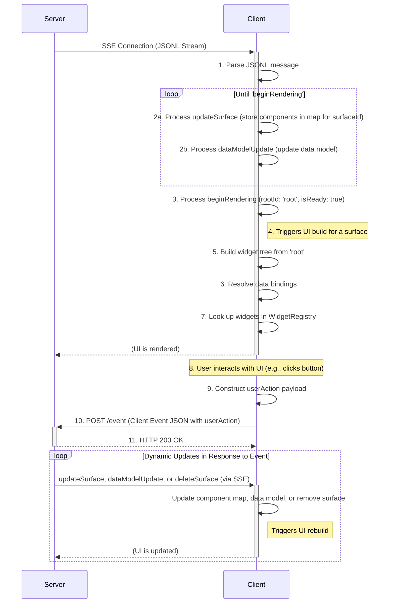
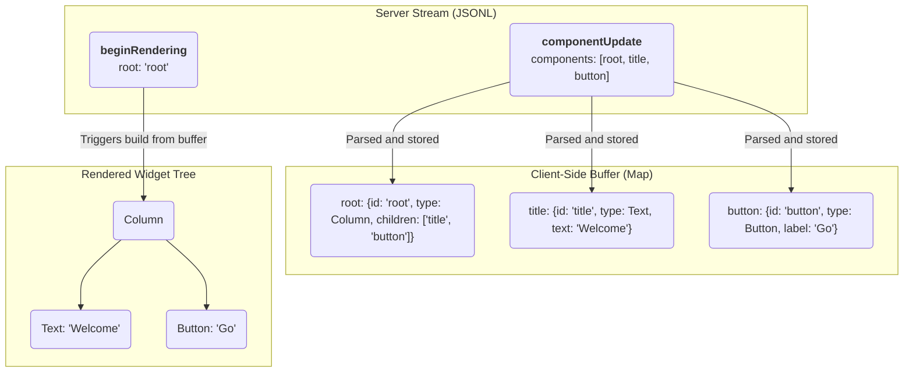

# GULF (Generative UI Language Format) Protocol

A Specification for a JSONL-Based, Streaming UI Protocol

Created: Sep 19, 2025

## Design Requirements

The GULF protocol should be a system where an LLM can stream a platform-agnostic, abstract UI definition to a client, which then renders it progressively using a native widget set. Every major design choice is traced back to the core challenges of LLM generation, perceived performance, and platform independence.

### Requirement: The protocol must be easily generated by a Transformer Large Language Model (LLM)

This is the most critical driver. "LLM-friendliness" is explicitly mentioned. This requirement directly leads to several design choices:

Declarative, Simple Structure: The protocol should use a straightforward, declarative format ("this is a column with these children") rather than an imperative one ("now, add a column; then, append a text widget to it"). LLMs excel at generating structured, declarative data.

Flat Component List (Adjacency List): Requiring an LLM to generate a perfectly nested JSON tree in a single pass is difficult and error-prone. A flat list of components, where relationships are defined by simple string IDs, is much easier to generate piece by piece. The model can "think" of a component, give it an ID, and then reference that ID later without worrying about tree depth or object nesting.

Stateless Messages: Each JSONL message is a self-contained unit of information (componentUpdate, dataModelUpdate). This is ideal for a streaming LLM, which can output these messages incrementally as it processes a request.

### Requirement: The UI must render progressively for a fast, responsive user experience

The system must feel fast to the user, even if the full UI is complex and takes time to generate.

Streaming via JSONL/SSE: This is a direct solution. The client doesn't have to wait for a single, massive JSON payload. It can start receiving and processing UI components immediately, improving perceived performance.

### Requirement: The protocol must be platform-agnostic

The same server-side logic should be able to render a UI on a Flutter app, a web browser, or potentially other platforms without modification.

Client-Defined widget catalog: This is the core of the platform-agnostic design. The protocol should define an abstract component tree (e.g., "I need a Card with a Row inside"). It is the client's responsibility to map these abstract types to its native widget implementations (a Flutter Card widget, an HTML `<div>` with card styling, etc.). The server only needs to know the names of the components the client supports.

### Requirement: State management must be efficient and decoupled from the UI structure

Changing a piece of text in the UI should not require resending the entire UI definition.

Separation of Data and Components: Having distinct componentUpdate and data model update messages is key. The UI structure can be sent once, and subsequent updates can be small dataModelUpdate messages that only contain the changed data.

### Requirement: The communication architecture must be robust and scalable

The system needs a clear, reliable way to handle both server-pushed UI and client-initiated events.

Unidirectional UI Stream: Using a one-way stream (SSE) for UI updates simplifies the client's logic. It only needs to listen and react. This is a more robust pattern for server-push than trying to manage a complex bidirectional channel.

Out-of-Band Event Handling (REST API): Using a standard, stateless REST endpoint for user actions leverages a well-understood, highly scalable, and reliable web technology. It cleanly separates the concerns of UI rendering from event processing.

## Introduction

The GULF (Generative UI Language Format) Protocol is a protocol designed for rendering user interfaces from a stream of JSON objects sent from a server. Its core philosophy emphasizes a clean separation of UI structure and application data, enabling progressive rendering as the client processes each message.

The protocol is designed to be "LLM-friendly," meaning its structure is declarative and straightforward, making it easy for a generative model to produce.

Communication occurs via a JSON Lines (JSONL) stream. The client parses each line as a distinct message and incrementally builds the UI. The server-to-client protocol defines four message types:

- `updateSurface`: Provides a list of component definitions to be added to or updated in a specific UI area called a "surface."
- `dataModelUpdate`: Provides new data to be inserted into or to replace the client's data model. All surfaces share the same data model.
- `beginRendering`: Signals to the client that it has enough information to perform the initial render, specifying the ID of the root component.
- `deleteSurface`: Explicitly removes a surface and its contents from the UI.

Client-to-server communication for user interactions is handled separately via a JSON payload sent to a REST API. This message can be one of several types:
- `userAction`: Reports a user-initiated action from a component.
- `clientCapabilities`: Informs the server about the client's capabilities, such as the component catalog it supports.
- `error`: Reports a client-side error.
This keeps the primary data stream unidirectional.

## Section 1: Foundational Architecture and Data Flow

This document specifies the architecture and data formats for the GULF protocol. The design is guided by principles of strict separation of concerns, versioning, and progressive rendering.

### 1.1. Core Philosophy: Decoupling and Contracts

The central philosophy of GULF is the decoupling of three key elements:

1.  **The Component Tree (The Structure):** A server-provided tree of abstract components that describes the UI's structure. This is defined by `componentUpdate` messages.
2.  **The Data Model (The State):** A server-provided JSON object containing the dynamic values that populate the UI, such as text, booleans, or lists. This is managed via `dataModelUpdate` messages.
3.  **The Widget Registry (The "Catalog"):** A client-defined mapping of component types (e.g., "Row", "Text") to concrete, native widget implementations. This registry is **part of the client application**, not the protocol stream. The server must generate components that the target client's registry understands.

### 1.2. The JSONL Stream: The Unit of Communication

All UI descriptions are transmitted from the server to the client as a stream of JSON objects, formatted as JSON Lines (JSONL). Each line is a separate, compact JSON object representing a single message. This allows the client to parse and process each part of the UI definition as it arrives, enabling progressive rendering.

### 1.3. Surfaces: Managing Multiple UI Regions

A **Surface** is a contiguous portion of screen real estate into which a GULF UI can be rendered. The protocol introduces the concept of a `surfaceId` to uniquely identify and manage these areas. This allows a single GULF stream to control multiple, independent UI regions simultaneously. Each surface has a separate root component and a separate hierarchy of components. All surfaces share the same data model, to allow displaying the same data in different ways across multiple surfaces.

For example, in a chat application, each AI-generated response could be rendered into a separate surface within the conversation history. A separate, persistent surface could be used for a side panel that displays related information.

The `surfaceId` is used in `updateSurface` messages to direct component changes to the correct area, and the `deleteSurface` message allows for explicitly removing a surface and its contents from the UI.

### 1.4. Data Flow Model

The GULF protocol is composed of a server-to-client stream describing UI and individual events sent to the server. The client consumes the stream, builds the UI, and renders it. Communication occurs via a JSON Lines (JSONL) stream, typically transported over **Server-Sent Events (SSE)**.

1.  **Server Stream:** The server begins sending the JSONL stream over an SSE connection.
2.  **Client-Side Buffering:** The client receives messages and buffers them:

    - `updateSurface`: Component definitions are stored in a `Map<String, Component>`, organized by `surfaceId`. If a surface doesn't exist, it is created.
    - `dataModelUpdate`: The client's internal JSON data model is built or updated.

3.  **Render Signal:** The server sends a `beginRendering` message with the `root` component's ID. This prevents a "flash of incomplete content." The client buffers incoming components and data but waits for this explicit signal before attempting the first render, ensuring the initial view is coherent.
4.  **Client-Side Rendering:** The client, now in a "ready" state, starts at the `root` component. It recursively walks the component tree by looking up component IDs in its buffer. It resolves any data bindings against the data model and uses its `WidgetRegistry` to instantiate native widgets.
5.  **User Interaction and Event Handling:** The user interacts with a rendered widget (e.g., taps a button). The client constructs a `userAction` JSON payload, resolving any data bindings from the component's `action.context`. It sends this payload (as part of a larger client event message) to a pre-configured REST API endpoint on the server via a `POST` request.
6.  **Dynamic Updates:** The server processes the `userAction`. If the UI needs to change in response, the server sends new `updateSurface` and `dataModelUpdate` messages over the original SSE stream. As these arrive, the client updates its component buffer and data model, and the UI re-renders to reflect the changes. The server can also send `deleteSurface` to remove a UI region.



### 1.5. Full Stream Example

The following is a complete, minimal example of a JSONL stream that renders a user profile card.

```jsonl
{"updateSurface": {"components": [{"id": "root", "componentProperties": {"Column": {"children": {"explicitList": ["profile_card"]}}}}]}}
{"updateSurface": {"components": [{"id": "profile_card", "componentProperties": {"Card": {"child": "card_content"}}}]}}
{"updateSurface": {"components": [{"id": "card_content", "componentProperties": {"Column": {"children": {"explicitList": ["header_row", "bio_text"]}}}}]}}
{"updateSurface": {"components": [{"id": "header_row", "componentProperties": {"Row": {"alignment": "center", "children": {"explicitList": ["avatar", "name_column"]}}}}]}}
{"updateSurface": {"components": [{"id": "avatar", "componentProperties": {"Image": {"url": {"literalString": "[https://www.example.com/profile.jpg)"}}}}]}}
{"updateSurface": {"components": [{"id": "name_column", "componentProperties": {"Column": {"alignment": "start", "children": {"explicitList": ["name_text", "handle_text"]}}}}]}}
{"updateSurface": {"components": [{"id": "name_text", "componentProperties": {"Heading": {"level": "3", "text": {"literalString": "Flutter Fan"}}}}]}}
{"updateSurface": {"components": [{"id": "handle_text", "componentProperties": {"Text": {"text": {"literalString": "@flutterdev"}}}}]}}
{"updateSurface": {"components": [{"id": "bio_text", "componentProperties": {"Text": {"text": {"literalString": "Building beautiful apps from a single codebase."}}}}]}}
{"dataModelUpdate": {"contents": {}}}
{"beginRendering": {"root": "root"}}
```

## Section 2: The Component Model

GULF's component model is designed for flexibility, separating the protocol from the component set.

### 2.1. The Catalog: Defining Components

Unlike previous versions with a fixed component set, GULF now defines components in a separate **Catalog**. A catalog is a schema that defines the available component types (e.g., `Row`, `Text`) and their supported properties. This allows for different clients to support different sets of components, including custom ones. The server must generate `updateSurface` messages that conform to the component catalog understood by the client. Clients can inform the server of the catalog they support using the `clientCapabilities` message.

### 2.2. The `updateSurface` Message

This message is the primary way UI structure is defined. It contains a `components` array and targets a specific `surfaceId`.

```json
{
  "updateSurface": {
    "surfaceId": "main_content_area",
    "components": [
      {
        "id": "unique-component-id",
        "weight": 1.0,
        "componentProperties": {
          "Text": {
            "text": { "literalString": "Hello, World!" }
          }
        }
      },
      {
        "id": "another-component-id",
        "componentProperties": { ... }
      }
    ]
  }
}
```

- `surfaceId`: An optional string identifying the UI surface to update. If omitted, a default surface is used.
- `components`: A required flat list of component instances.

### 2.3. The Component Object

Each object in the `components` array has the following structure:

- `id`: A required, unique string that identifies this specific component instance. This is used for parent-child references.
- `weight`: An optional number used by `Row` and `Column` containers to determine proportional sizing.
- `componentProperties`: A required object that defines the component's type and properties.

### 2.4.`componentProperties` (Generic Object)

On the wire, this object is generic. Its structure is not defined by the core GULF protocol. Instead, its validation is based on the active **Catalog**. For a given component, it **must** contain exactly one key, where the key is the string name of the component type from the catalog (e.g., `"Text"`, `"Row"`). The value is an object containing the properties for that component, as defined in the catalog.

**Example:** A `Text` component:

```json
"componentProperties": {
  "Text": {
    "text": { "literalString": "This is text" }
  }
}
```

A `Button` component:

```json
"componentProperties": {
  "Button": {
    "label": { "literalString": "Click Me" },
    "action": { "action": "submit_form" }
  }
}
```

The full set of available component types and their properties is defined by a **Catalog Schema**, not in the core protocol schema.

## Section 3: UI Composition

### 3.1. The Adjacency List Model

The GULF protocol defines the UI as a flat list of components. The tree structure is built implicitly using ID references. This is known as an adjacency list model.

Container components (like `Row`, `Column`, `List`, `Card`) have properties that reference the `id` of their child component(s). The client is responsible for storing all components in a map (e.g., `Map<String, Component>`) and recreating the tree structure at render time.

This model allows the server to send component definitions in any order, as long as all necessary components are present by the time `beginRendering` is sent.



### 3.2. Container Children: `explicitList` vs. `template`

Container components (`Row`, `Column`, `List`) define their children using a `children` object, which must contain _either_ `explicitList` or `template`.

- `explicitList`: An array of component `id` strings. This is used for static, known children.
- `template`: An object used to render a dynamic list of children from a data-bound list.

```json
// Example: Children property from gulf_schema.json
"children": {
  "description": "Defines the children... You MUST define EITHER 'explicitList' OR 'template'",
  "properties": {
    "explicitList": {
      "type": "array",
      "items": { "type": "string" }
    },
    "template": {
      "type": "object",
      "properties": {
        "componentId": { "type": "string" },
        "dataBinding": { "type": "string" }
      },
      "required": ["componentId", "dataBinding"]
    }
  }
}
```

### 3.3. Dynamic List Rendering with `template`

To render dynamic lists, a container uses the `template` property.

1.  `dataBinding`: A path to a list in the data model (e.g., `user.posts`).
2.  `componentId`: The `id` of another component in the buffer to use as a template for each item in the list.

The client will iterate over the list at `dataBinding` and, for each item, render the component specified by `componentId`. The item's data is made available to the template component for relative data binding.

## Section 4: Dynamic Data & State Management

GULF enforces a clean separation between the UI's structure (components) and its dynamic data (data model).

### 4.1. The `dataModelUpdate` Message

This message is the only way to modify the client's data model.

- `contents`: The JSON content to be inserted.
- `path`: An optional, dot-separated path string.

  - If `path` is `null` or empty, the `contents` will **completely replace** the entire data model.
  - If `path` is provided (e.g., `user.name` or `user.addresses[0].street`), the client will traverse the data model and insert the `contents` at that specific location, creating nested objects/lists as needed.

#### Example 1: Replacing the root data model

```json
{
  "dataModelUpdate": {
    "contents": {
      "user": { "name": "Alice" },
      "posts": []
    }
  }
}
```

#### Example 2: Updating a specific path

```json
{
  "dataModelUpdate": {
    "path": "user.name",
    "contents": "Bob"
  }
}
```

### 4.2. Data Binding (The `BoundValue` Object)

Components connect to the data model through binding. Any property that can be data-bound (like `text` on a `Text` component) accepts a `BoundValue` object. This object defines either a literal value, a data path, or both as a shorthand for initialization.

From the catalog schema, a bound `text` property looks like this:

```json
"text": {
  "properties": {
    "path": { "type": "string" },
    "literalString": { "type": "string" }
  }
}
```

A component can also bind to numbers (`literalNumber`), booleans (`literalBoolean`), or arrays (`literalArray`). The behavior depends on which properties are provided:

- **Literal Value Only**: If only a `literal*` value (e.g., `literalString`) is provided, the value is static and displayed directly.

  ```json
  "text": { "literalString": "Hello" }
  ```

- **Path Only**: If only `path` is provided, the value is dynamic. It's resolved from the data model at render time.

  ```json
  "text": { "path": "user.name" }
  ```

- **Path and Literal Value (Initialization Shorthand)**: If **both** `path` and a `literal*` value are provided, it serves as a shorthand for data model initialization. The client MUST:
    1.  Update the data model at the specified `path` with the provided `literal*` value. This is an implicit `dataModelUpdate`.
    2.  Bind the component property to that `path` for rendering and future updates.

  This allows the server to set a default value and bind to it in a single step.

  ```json
  // This initializes data model at 'user.name' to "Guest" and binds to it.
  "text": { "path": "user.name", "literalString": "Guest" }
  ```

The client's interpreter is responsible for resolving these paths against the data model before rendering. The GULF protocol supports direct 1:1 binding; it does not include transformers (e.g., formatters, conditionals). Any data transformation must be performed by the server before sending it in a `dataModelUpdate`.

## Section 5: Event Handling

While the server-to-client UI definition is a one-way stream, user interactions and other client-side information are communicated back to the server using a separate, out-of-band mechanism. This is typically a standard REST API endpoint where the client sends a `POST` request with a single client event message.

### 5.1. The Client Event Message

The client sends a single JSON object that acts as a wrapper. It must contain exactly one of the following keys: `userAction`, `clientCapabilities`, or `error`.

### 5.2. The `userAction` Message

This message is sent when the user interacts with a component that has an action defined. It is the primary mechanism for user-driven events.

The `userAction` object has the following structure:

- `actionName` (string, required): The name of the action, taken directly from the `action.action` property of the component (e.g., "submit_form").
- `sourceComponentId` (string, required): The `id` of the component that triggered the event (e.g., "my_button").
- `timestamp` (string, required): An ISO 8601 timestamp of when the event occurred (e.g., "2025-09-19T17:01:00Z").
- `resolvedContext` (object, required): A JSON object containing the key-value pairs from the component's `action.context`, after resolving all `BoundValue`s against the data model.

The process for resolving the `action.context` remains the same: the client iterates over the `context` array, resolves all literal or data-bound values, and constructs the `resolvedContext` object.

### 5.3. The `clientCapabilities` Message

This message is sent by the client to inform the server about its capabilities. This is crucial for supporting different component sets. The message must contain exactly one of the following properties:

- `catalogUri`: A URI pointing to a predefined component catalog schema that the client supports.
- `dynamicCatalog`: An inline JSON object, conforming to the Catalog Schema, that defines the client's supported components. This is useful for development or for clients with highly custom component sets.

### 5.4. The `error` Message

This message provides a feedback mechanism for the server. It is sent when the client encounters an error, for instance, during UI rendering or data binding. The content of the object is flexible and can contain any relevant error information.

### 5.5. Event Flow Example (`userAction`)

1.  **Component Definition** (from `updateSurface`):

    ```json
    {
      "id": "submit_btn",
      "componentProperties": {
        "Button": {
          "label": { "literalString": "Submit" },
          "action": {
            "action": "submit_form",
            "context": [
              { "key": "userInput", "value": { "path": "form.textField" } },
              { "key": "formId", "value": { "literalString": "f-123" } }
            ]
          }
        }
      }
    }
    ```

2.  **Data Model** (from `dataModelUpdate`):

    ```json
    {
      "form": {
        "textField": "User input text"
      }
    }
    ```

3.  **User Action:** The user taps the "submit_btn" button.
4.  **Client-Side Resolution:** The client resolves the `action.context`.
5.  **Client-to-Server Request:** The client sends a `POST` request to `https://api.example.com/handle_event` with the following JSON body:

    ```json
    {
      "userAction": {
        "actionName": "submit_form",
        "sourceComponentId": "submit_btn",
        "timestamp": "2025-09-19T17:05:00Z",
        "resolvedContext": {
          "userInput": "User input text",
          "formId": "f-123"
        }
      }
    }
    ```

6.  **Server Response:** The server processes this event. If the UI needs to change as a result, the server sends new `updateSurface` or `dataModelUpdate` messages over the **separate SSE stream**.

## Section 6: Client-Side Implementation

A robust client-side interpreter for GULF should be composed of several key components:

- **JSONL Parser:** A parser capable of reading the stream line by line and decoding each line as a separate JSON object.
- **Message Dispatcher:** A mechanism (e.g., a `switch` statement) to identify the message type (`streamHeader`, `componentUpdate`, etc.) and route it to the correct handler.
- **Component Buffer:** A `Map<String, Component>` that stores all component instances by their `id`. This is populated by `componentUpdate` messages.
- **Data Model Store:** A `Map<String, dynamic>` (or similar) that holds the application state. This is built and modified by `dataModelUpdate` messages.
- **Interpreter State:** A state machine to track if the client is ready to render (e.g., a `_isReadyToRender` boolean that is set to `true` by `beginRendering`).
- **`**WidgetRegistry**`**:\*\*\*\* A developer-provided map (e.g., `Map<String, WidgetBuilder>`) that associates component type strings ("Row", "Text") with functions that build native widgets.
- **Binding Resolver:** A utility that can take a `BoundValue` (e.g., `{ "path": "user.name" }`) and resolve it against the Data Model Store.
- **Surface Manager:** Logic to create, update, and delete UI surfaces based on `surfaceId`.
- **Event Handler:** A function, exposed to the `WidgetRegistry`, that constructs and sends the client event message (e.g., `userAction`) to the configured REST API endpoint.

## Section 7: Complete GULF JSON Schema

This section provides the formal JSON Schema for a single server-to-client message in the GULF JSONL stream. Each line in the stream must be a valid JSON object that conforms to this schema. Note that the component set is not defined here, but in a separate Catalog schema.

```json
{
  "title": "GULF Protocol Message",
  "description": "A single message in the GULF streaming UI protocol. Exactly ONE of the properties in this object must be set, corresponding to the specific message type.",
  "type": "object",
  "properties": {
    "beginRendering": {
      "title": "BeginRendering Message",
      "description": "A schema for a BeginRendering message in the GULF streaming UI protocol. This message signals that the UI can now be rendered and provides initial root component and styling information.",
      "type": "object",
      "properties": {
        "root": {
          "type": "string",
          "description": "The ID of the root component from which rendering should begin. This is a reference to a component instance by its unique ID. This property is REQUIRED."
        },
        "styles": {
          "type": "object",
          "description": "An object containing styling information for the UI, as defined by the active Catalog.",
          "additionalProperties": true
        }
      },
      "required": [
        "root"
      ]
    },
    "updateSurface": {
      "title": "UpdateSurface Message",
      "description": "A schema for a updateSurface message in the GULF streaming UI protocol.",
      "type": "object",
      "properties": {
        "surfaceId": {
          "type": "string",
          "description": "An ID for the surface that the UI changes should be applied to. If this surface doesn't exist, it will be created. If this is not specified, the default surface will be used."
        },
        "components": {
          "type": "array",
          "description": "A flat list of all component instances available for rendering. Components reference each other by ID. This property is REQUIRED.",
          "items": {
            "description": "A specific instance of a ComponentType with its own unique ID and properties.",
            "type": "object",
            "properties": {
              "id": {
                "type": "string",
                "description": "A unique identifier for this component instance. This property is REQUIRED."
              },
              "componentProperties": {
                "type": "object",
                "description": "Defines the properties for the component type, according to the active Catalog.",
                "additionalProperties": true
              }
            },
            "required": [
              "id",
              "componentProperties"
            ]
          }
        }
      },
      "required": [
        "components"
      ]
    },
    "dataModelUpdate": {
      "title": "Data model update",
      "description": "Sets or replaces the data model at a specified path with new content.",
      "type": "object",
      "properties": {
        "path": {
          "type": "string",
          "description": "An optional path to a location within the data model where the content should be inserted or replaced. The path is represented as a dot-separated string and can include array indexing (e.g., 'user.addresses[0].street'). If this field is omitted, the entire data model will be replaced with the provided 'contents'."
        },
        "contents": {
          "description": "The JSON content to be placed at the specified path. This property is REQUIRED. This can be any valid JSON value (object, array, string, number, boolean, or null). The content at the target path will be completely replaced by this new value."
        }
      },
      "required": [
        "contents"
      ]
    },
    "deleteSurface": {
      "title": "DeleteSurface Message",
      "description": "A schema for a DeleteSurface message in the GULF streaming UI protocol. This message signals that a surface should be removed from the UI.",
      "type": "object",
      "properties": {
        "surfaceId": {
          "type": "string",
          "description": "The ID of the surface to be deleted. This property is REQUIRED."
        }
      },
      "required": [
        "surfaceId"
      ]
    }
  }
}
```
